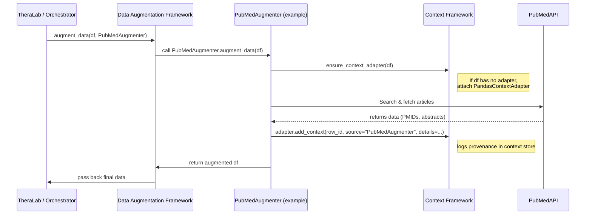

# Data Augmentation Framework  
**Integration with Context-Framework**  
`docs/api/integration_with_context.md`

## 1. Introduction

This document details how classes and functions within the **data-augmentation-framework** interact with the **context-framework**, specifically focusing on:

1. **Ensuring** that incoming data structures are wrapped with the appropriate context adapter (e.g., a Pandas DataFrame using a `PandasContextAdapter`).  
2. **Adding** or **updating** context entries after each augmentation or transformation.  
3. **Retrieving** context metadata for review or further processing.

---

## 2. Relationship to `context-framework`

The **data-augmentation-framework** relies on **context-framework** for:

- **Context Awareness**: The ability to attach metadata (e.g., who/what/when/why) to specific parts of a dataset—be that the entire dataset, or a row, column, or cell.  
- **Adapters**: Wrappers for common data structures (e.g., Pandas, Spark) that provide a uniform interface for logging and retrieving context.

### 2.1 Architecture Overview

```
                   [ data-augmentation-framework ]
  +-----------------------------------------------------------+
  |    augmenters/      concurrency/    orchestrator.py      |
  |       (PubMed, HPC, finance, etc.)                       |
  |                                                          |
  |    Integration with Context-Framework:                   |
  |   * ensure_context_adapter                               |
  |   * add_context(...)                                     |
  +-----------------------------------------------------------+
                           |
                           v
          [ context-framework / context_adapters / stores ]
  +-----------------------------------------------------------+
  |   ContextAwareDataStructure, BaseContextAdapter, etc.     |
  |   - Attaches metadata (timestamp, source) to dataset      |
  |   - Provides APIs for reading/writing provenance          |
  +-----------------------------------------------------------+
```

The **data-augmentation-framework** makes calls down to the **context-framework** whenever a transformation occurs, ensuring **traceability** and **auditability** of every data augmentation step.

---

## 3. Context Adapter Basics

### 3.1 Context Adapter Concept

A **context adapter** is an object (often a class) that mediates between a raw data structure (like a Pandas DataFrame) and the context store. It provides methods such as:

- `add_context(item_id, source, details)`  
- `get_context(item_id)`  
- Potentially others (updating, removing context entries, searching metadata, etc.)

### 3.2 Typical Adapters

Common adapters might include:

- **`PandasContextAdapter`**: Attaches context to rows (by index) or columns (by name) in a DataFrame.  
- **`InMemoryContextStore`**: Holds context in a Python dictionary.  
- **`RedisContextStore`** (or other external store): Persists context in Redis for distributed access.

---

## 4. `ensure_context_adapter` Utility

Many augmenters in this framework call a helper function—often named something like `ensure_context_adapter`—that checks if the incoming data has an adapter attached. If not, it creates/wraps one.

### 4.1 Example Implementation

```python
# context_integration/utils.py (or a similar location)
from context_framework.adapters import PandasContextAdapter

def ensure_context_adapter(data):
    """
    Ensures 'data' is wrapped with a context adapter if it isn't already.
    Returns the adapter object, enabling calls like add_context(...).
    """
    if not hasattr(data, "_context_adapter"):
        # Check if data is a Pandas DataFrame
        if is_pandas_dataframe(data):
            data._context_adapter = PandasContextAdapter(data)
        else:
            raise TypeError("Unrecognized data type for context adapter.")
    return data._context_adapter

def is_pandas_dataframe(data):
    """Simple check if 'data' is a Pandas DataFrame."""
    import pandas as pd
    return isinstance(data, pd.DataFrame)
```

### 4.2 Usage in an Augmenter

```python
# pubmed_augmenter.py
from data_augmentation_framework.api.integration_with_context import ensure_context_adapter

class PubMedAugmenter(BaseAugmenter):
    def augment_data(self, data, **kwargs):
        adapter = ensure_context_adapter(data)
        # ... perform augmentation ...
        adapter.add_context(
            item_id="some_unique_identifier",
            source="PubMedAugmenter",
            details={"pmids": [...], "timestamp": "2025-01-01T00:00:00Z"}
        )
        return data
```

In this snippet:

1. The **augmenter** calls `ensure_context_adapter(data)` to confirm that the dataset has a context adapter.  
2. Once the dataset has an adapter, the augmenter can easily **add context** or retrieve existing context.

---

## 5. Adding Context Entries

### 5.1 Adding Metadata

After each transformation, the framework calls `adapter.add_context(...)`, usually with:

- **`item_id`**: Identifies which row/column/cell or dataset-level entity the context applies to.  
- **`source`**: Usually the augmenter name (e.g., `"GeneAugmenter"`) or the transformation type (e.g., `"merge_columns"`).  
- **`details`**: A dictionary of arbitrary metadata—timestamp, parameters used, references to external resources, etc.

**Example**:

```python
adapter.add_context(
    item_id=row_index,
    source="GeneAugmenter",
    details={
        "normalized_symbol": new_symbol,
        "gene_id": raw_gene_id,
        "timestamp": datetime.utcnow().isoformat()
    }
)
```

### 5.2 Granularity

- **Row-Level**: The `item_id` might be a row index (e.g., integer or UUID).  
- **Column-Level**: The `item_id` might be the column name (e.g., `"gene_symbol"`).  
- **Dataset-Level**: The `item_id` could be something like `"global"` or `None` to indicate a transformation affecting the entire dataset.

---

## 6. Retrieving Context Entries

In some scenarios, augmenters or orchestrators might need to **read existing context** to inform new transformations. For example, if a user has already annotated a gene column with certain tags or references, an augmenter can factor that into its logic.

```python
context_info = adapter.get_context(item_id="gene_symbol")
# context_info might be a list/dict of prior transformations or user annotations
```

### 6.1 Potential Uses

- **Chaining**: A second augmenter might retrieve the output of a previous transformation.  
- **Conflict Resolution**: If multiple augmenters wrote conflicting metadata, the orchestrator can examine these logs to decide a final result.  
- **User Annotation**: If a user manually annotated some rows, new augmenters might skip or refine transformations based on that annotation.

---

## 7. Concurrency & Context

When **concurrency** is involved (e.g., chunked or parallel tasks):

1. Each chunk is typically **wrapped** by an adapter separately (or the entire dataset is globally wrapped).  
2. **Concurrent** augmenters can safely write to the context store if the underlying store is thread-safe or distributed.  
3. The concurrency manager merges the chunked data back, preserving context from each sub-task.

> **Best Practice**: The concurrency manager should ensure that each chunk’s adapter references the same global or distributed **context store** (e.g., `RedisContextStore`) if you need cross-chunk traceability.

---

## 8. Best Practices & Guidelines

1. **Always Wrap Data**  
   - The first step in an augmentation is to call `ensure_context_adapter`. If you skip this, context logging calls (e.g., `add_context`) will fail.  
2. **Keep It Granular**  
   - For row-based transformations, specify the **row index** in `item_id`; for column-based changes, use the **column name**. This helps future debugging and traceability.  
3. **Use Clear “source” Fields**  
   - E.g., `"PubMedAugmenter"`, `"FinanceAugmenter"`. This ensures logs can be easily filtered or summarized by transformation type.  
4. **Log Enough Detail**  
   - Include relevant **parameters** (e.g., search keywords, HPC job IDs), **timestamps**, or external references (e.g., “PubMed IDs: [12345,67890]”).  
5. **Leverage the Context**  
   - If a new augmentation depends on the result or configuration of a previous step, read from the context store to avoid re-doing or conflicting transformations.

---

## 9. Example End-to-End Flow

Below is a simplified flow showing **TheraLab** calling the **Data Augmentation Framework**, which in turn uses the **context-framework**:



1. **TheraLab** → **Data Augmentation Framework** with a request to augment data.  
2. **Augmenter** ensures the data is context-aware, then does the external retrieval.  
3. Upon success, the augmenter **adds context** via the adapter.  
4. The updated data (with context logs attached) returns to TheraLab.

---

## 10. Frequently Asked Questions

1. **How do I attach my own context store, like Redis?**  
   - You can configure the context-framework to use `RedisContextStore` instead of the default in-memory store. Ensure your data is wrapped by an adapter pointing to that store.

2. **What if I need advanced logic (e.g., partial cell-level logs)?**  
   - Each adapter can be extended to store context at a fine-grained level (e.g., row + column). For Pandas, you might call `add_context((row_index, col_name), ...)`.  

3. **Can I retrieve the entire context log for a dataset after multiple augmentations?**  
   - Yes. The adapter or store typically provides a method like `get_all_context()`. Alternatively, you can iterate over row/column IDs.

4. **What if the dataset is huge?**  
   - For large datasets, consider using concurrency or HPC flows. The **context-framework** can handle partial or chunked logging. Just ensure the concurrency manager merges context from each chunk if needed.

---

## 11. Conclusion

The **data-augmentation-framework** integrates seamlessly with the **context-framework** by wrapping incoming data with a **context adapter** and then logging each transformation. This ensures:

- **Provenance**: You always know which augmenter changed which parts of the data, and why.  
- **Traceability**: Future steps or audits can review exactly how the data was enriched.  
- **Collaboration**: Multiple augmenters can read or write context in a shared store, enabling complex pipelines.

By following the guidelines here—especially ensuring that your augmentation code uses `ensure_context_adapter` and carefully calls `add_context(...)`—you’ll maintain a clear, audit-ready record of every data transformation.

---

**Document History**  
- **v1.0** – Initial publication detailing how data-augmentation-framework integrates with the context-framework.  
- **v1.1** – Added concurrency considerations and extended best practices.

_End of Document_