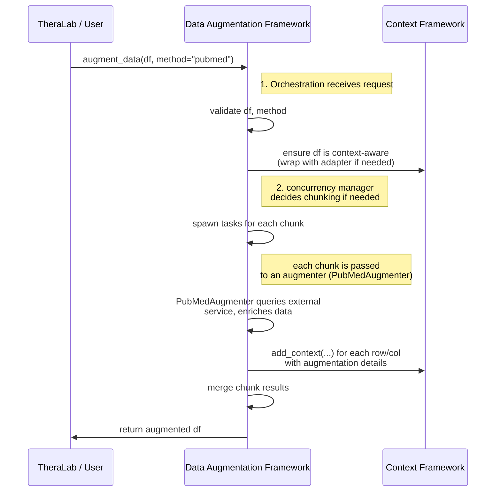

# Data Augmentation Framework  
**Design & Architecture Overview**  
`docs/design/architecture.md`

## 1. Introduction

This document provides a high-level overview of the **Data Augmentation Framework**, detailing its architectural components, data flow, and integration points with the **Context-Tracking Framework** and external data sources. It is intended for developers, architects, and stakeholders looking to understand or extend the framework.

### 1.1 Purpose & Scope

- **Purpose**:  
  - To clarify how different modules (Augmenters, Concurrency, Caching, Logging) interact with one another and with upstream/downstream components.  
- **Scope**:  
  - The internal structure of the data-augmentation-framework repository.  
  - How it communicates with the Context-Tracking Framework (`thera-core/context-framework`).  
  - Interface points for external APIs or HPC systems.

### 1.2 Key Goals

1. **Modularity**: Easy to add or remove data augmenters.  
2. **Traceability**: All transformations should be logged via the context system.  
3. **Scalability**: Ability to handle large datasets or HPC-based tasks.  
4. **Extensibility**: Straightforward to add new data adapters, concurrency models, or data sources.

---

## 2. High-Level Architecture

The **Data Augmentation Framework** is structured around **three core layers**:

1. **Augmenter Layer**: A set of classes/functions (e.g., `PubMedAugmenter`, `GeneNormalizationAugmenter`) that perform domain-specific transformations or external lookups.  
2. **Orchestration & Concurrency Layer**: Logic for managing tasks, chunking large data sets, parallel processing, and (optionally) distributing workloads to HPC nodes.  
3. **Context Integration Layer**: Interfaces with `context-framework` to add or retrieve provenance information, ensuring that each transformation is fully traceable.

```
 ┌──────────────────────────────────────────────────────────┐
 │                  TheraLab (caller)                      │
 │     (e.g., multi-agent orchestrator or user interface)  │
 └──────────────────────────────────────────────────────────┘
            |                  
            |  ① "Please augment data X"
            v                  
 ┌──────────────────────────────────────────────────────────┐
 │            Data Augmentation Framework                  │
 │  ┌────────────────────────┬───────────────────────────┐ │
 │  │   Augmenter Layer      │  Orchestration &           │ │
 │  │  (PubMed, HPC, etc.)   │  Concurrency Layer         │ │
 │  └────────────────────────┴───────────────────────────┘ │
 │                          ②                           │
 │                  "Add context/log"                    │
 │                          ③                           │
 └──────────────────────────────────────────────────────────┘
            |                  
            v                  
 ┌──────────────────────────────────────────────────────────┐
 │            Context-Tracking Framework                   │
 │     (ContextAwareDataStructure, adapters, stores)       │
 └──────────────────────────────────────────────────────────┘
```

1. **TheraLab** or another caller (e.g., multi-agent system) triggers an augmentation request.  
2. The **Data Augmentation Framework** runs the designated augmenter, potentially in parallel or chunked.  
3. Each augmenter interacts with the **Context-Tracking Framework** to record or retrieve metadata about the operation (e.g., provenance, timestamps, user annotations).

---

## 3. Key Components

### 3.1 Augmenters

**Definition**:  
An **Augmenter** is a class or function that takes incoming data (often a DataFrame or context-aware structure), performs some external lookup or transformation, and then updates the data with new information and associated context.

**Examples**:
- **`PubMedAugmenter`**  
  - Queries PubMed for specific keywords or gene references, returns summarized abstracts or metadata.  
  - Logs the transformations (e.g., the PubMed query terms, timestamps) into the context store.
- **`GeneNormalizationAugmenter`**  
  - Maps raw gene symbols or identifiers (from CSV/Pandas columns) to standardized nomenclature.  
  - Records each mapping in the context store, including any confidence scores.

**Key Properties**:
- **Input**: Typically a context-aware data structure (or standard DataFrame that is wrapped by an adapter).  
- **Output**: The same data structure updated (or a new one returned) with additional fields/columns and context logs.

> **Implementation Note**:  
> Each augmenter can inherit from a base class like `BaseAugmenter`, which provides utility methods (logging, caching, concurrency hooks).

### 3.2 Orchestration & Concurrency Layer

**Purpose**:
- Manage **batch** or **chunked** processing for large datasets.  
- Optionally handle **parallel or distributed** execution using Python concurrency (threads, multiprocessing, or HPC job submission).

**Core Responsibilities**:
1. **Chunking**: Split large data sets into smaller, manageable pieces.  
2. **Thread/Process Pools**: Assign tasks to workers for faster augmentation.  
3. **Error Handling & Retries**: If an augmenter fails for a particular chunk, decide whether to retry, skip, or abort.  
4. **Merging Results**: Combine augmented chunks back into a single context-aware data structure.

> **Implementation Approaches**:
> - **Local Concurrency**: ThreadPoolExecutor or ProcessPoolExecutor.  
> - **Distributed HPC**: Integration with Slurm, Spark, or Dask for large-scale parallelism.  

### 3.3 Context Integration Layer

**Description**:
- Central to the framework’s design.  
- Integrates with `thera-core/context-framework` to:
  1. **Retrieve** existing context (e.g., user annotations, prior transformations).  
  2. **Add** new context entries each time an augmentation is performed.

**Key Interfaces**:
- **`ContextAwareDataStructure`**:  
  - Data structure that supports attaching metadata at different granularity levels (entire dataset, row, column, or cell).  
- **`ContextAdapter`**:  
  - Methods to set or get context, e.g., `adapter.add_context(row_id, "PubMedAugmenter", {...details})`.

**Workflow**:
1. **Data Input**: Check if it already has context adapter references (if not, wrap/convert it).  
2. **Augment**: When the augmenter modifies the data, it calls `adapter.add_context()` or a similar function to log the operation.  
3. **Data Output**: The updated context-aware data structure is returned to the caller.

---

## 4. Data Flow & Sequence

### 4.1 Typical Sequence Example

Below is a **simplified** sequence diagram showing how a request from **TheraLab** might flow through the Data Augmentation Framework:



1. **TheraLab** calls `augment_data(...)`.  
2. **Data Augmentation Framework** ensures the data is context-aware.  
3. A concurrency manager may split the data (if large) and assign each portion to a relevant augmenter.  
4. **Augmenter** performs external lookups, updates the data, and logs provenance with the **Context Framework**.  
5. Results are merged and returned.

---

## 5. Detailed Architecture Components

### 5.1 Package Structure (Proposed)

```
data-augmentation-framework/
├─ augmenters/
│  ├─ base_augmenter.py       # Abstract BaseAugmenter, core utility methods
│  ├─ pubmed_augmenter.py     # Example: queries PubMed, logs contexts
│  └─ gene_normalizer.py      # Example: normalizes gene symbols, logs contexts
├─ concurrency/
│  ├─ local_executor.py       # Thread/process pool logic
│  ├─ hpc_executor.py         # HPC or cluster-based job submission logic
│  └─ concurrency_manager.py  # Unified interface to pick an executor
├─ context_integration/
│  ├─ context_hooks.py        # Helper functions to attach/retrieve context
│  └─ ...
├─ caching/
│  ├─ cache_manager.py        # High-level caching interface
│  ├─ in_memory_cache.py      # Basic dictionary-based or LRU caching
│  └─ ...
├─ orchestrator.py            # Main entry point for augmentation requests
├─ __init__.py
└─ ...
```

1. **`augmenters/`**  
   - Houses individual augmentation modules, each typically subclassing or implementing a common interface.  
2. **`concurrency/`**  
   - Contains logic for multi-threading, multiprocessing, or HPC/cluster submission.  
3. **`context_integration/`**  
   - Functions or classes that simplify calls to `context-framework`.  
4. **`caching/`**  
   - Infrastructure for caching repeated external queries or transformations.  
5. **`orchestrator.py`**  
   - A high-level facade that orchestrates the augmentation process, selecting the right augmenter, applying concurrency, and returning results.

### 5.2 Concurrency Model

**Local vs. Distributed**  
- **Local**:  
  - Use Python `ThreadPoolExecutor` or `ProcessPoolExecutor` for parallel I/O or CPU-bound tasks.  
  - Minimal overhead, suitable for moderate data sizes.  
- **Distributed** (Future or HPC Use Cases):  
  - Integrate with HPC schedulers (e.g., Slurm) or libraries like Dask/Spark for large-scale tasks.  
  - Or wrap HPC calls in a specialized augmenter that delegates tasks to GPU clusters or HPC nodes.

### 5.3 Caching Model

- **In-Memory Cache**: For smaller datasets or repeated lookups (e.g., gene identifiers).  
- **Distributed Cache**: (e.g., Redis) if multiple processes or HPC nodes need shared state.  
- **Cache Keys**: Typically derived from input parameters (e.g., gene ID, PubMed query).  
- **Eviction Policies**: Time-based (TTL) or size-based (LRU).

### 5.4 Logging & Error Handling

- **Logging**:  
  - Each augmenter and concurrency manager writes logs (e.g., start time, end time, success/failure).  
  - Log messages include unique context IDs or operation IDs for correlation.  
- **Error Handling**:  
  - Retries for transient errors (network failures, HPC node unavailability).  
  - Graceful fallback or partial completion for chunked tasks if some chunks fail.

---

## 6. Integration with Other Modules

### 6.1 Context-Tracking Framework

**Key Points**:
- The data-augmentation-framework **depends** on the `context-framework`.  
- Each augmenter will either:
  1. **Wrap** the input data in a `ContextAwareDataStructure` if it isn’t already.  
  2. **Update** the context store with relevant metadata (`adapter.add_context(...)`).  
- **Provenance**: The context store logs the name of the augmenter, parameters used, timestamp, and possibly a link to external references (e.g., PubMed IDs).

### 6.2 TheraLab (Caller)

- Typically, TheraLab’s multi-agent orchestrator or user interface calls `augment_data(...)` in this framework, specifying:
  - **Data** (DataFrame, CSV path, or other structure).  
  - **Augmenter** (PubMed, gene normalization, HPC transformations).  
  - **Options** (chunk size, concurrency level, caching policies, etc.).  
- The framework returns the augmented data with enriched columns or metadata, plus all transformations tracked in the context store.

### 6.3 External Data Sources

- **PubMed**: The `PubMedAugmenter` might call the NCBI E-utilities or a third-party library.  
- **Gene Databases**: Another augmenter might query NCBI’s gene info, or local HPC data sets.  
- **HPC**: Specialized augmenters might rely on HPC libraries (e.g., GPU-accelerated transformations) or submit jobs to a cluster.

---

## 7. Example Usage Flow

1. **Setup**:  
   ```python
   from data_augmentation_framework.orchestrator import augment_data
   from data_augmentation_framework.augmenters.pubmed_augmenter import PubMedAugmenter

   # For demonstration, "df" can be a Pandas DataFrame
   df = load_some_initial_data()  # e.g., CSV read
   ```
2. **Augment**:  
   ```python
   # User wants to fetch PubMed abstracts for gene columns
   augmented_df = augment_data(
       data=df,
       augmenter=PubMedAugmenter,
       augmenter_params={"column_name": "gene_id"},
       chunk_size=10000,
       enable_cache=True
   )
   ```
3. **Results**:  
   - The returned `augmented_df` is context-aware (if not initially).  
   - `adapter.get_context(...)` can reveal all transformations performed.  
4. **Downstream**:  
   - TheraLab or another system can store the augmented dataset or pass it on to further analysis.

---

## 8. Extensibility & Future Directions

1. **New Data Formats**  
   - Spark DataFrames, Seurat objects (for single-cell genomics), etc.  
   - Add corresponding adapters in `context_integration/`.  

2. **Plugin Architecture**  
   - A mechanism for discovering custom augmenters via entry points or a plugin registry.  
   - Minimizes direct modification of core code.  

3. **Advanced HPC**  
   - Deeper integration with HPC job schedulers (Slurm, PBS) or GPU frameworks for large-scale transformations.  

4. **Distributed Context Stores**  
   - For extremely large scale, offload context data to a distributed database or key-value store (e.g., Redis cluster).  

5. **Microservices Approach**  
   - Potentially wrap the framework in a microservice or API so that other systems can call it over REST/GraphQL.

---

## 9. Conclusion

The **Data Augmentation Framework** is designed to **flexibly handle** data enrichment tasks—ranging from simple fetches (PubMed lookups) to complex HPC transformations—while **logging all metadata** via the `context-framework`. Its architecture emphasizes **modularity**, **scalability**, and **extensibility**, ensuring that developers can easily add new augmenters, integrate with HPC systems, and reliably track every transformation.

---

### References

- **Context-Tracking Framework Documentation**: Explains how to build and use `ContextAwareDataStructure` and adapters.  
- **Functional & Nonfunctional Requirements (docs/requirements)**: Defines what features and performance metrics are needed.  
- **TheraLab Orchestrator**: Demonstrates how the data-augmentation-framework is called within a multi-agent environment.

---

**Document History**  
- **v1.0** – Initial draft, covering high-level architecture and design patterns.  
- **v1.1** – Added concurrency details, HPC references, and example usage flow.

---

_End of Document_