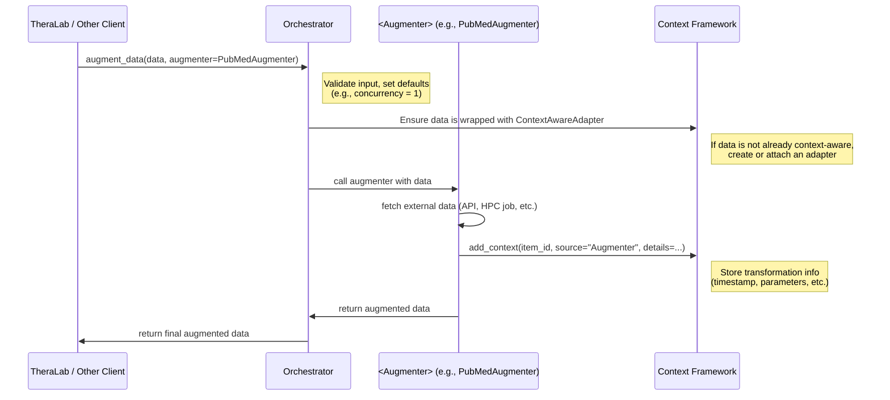
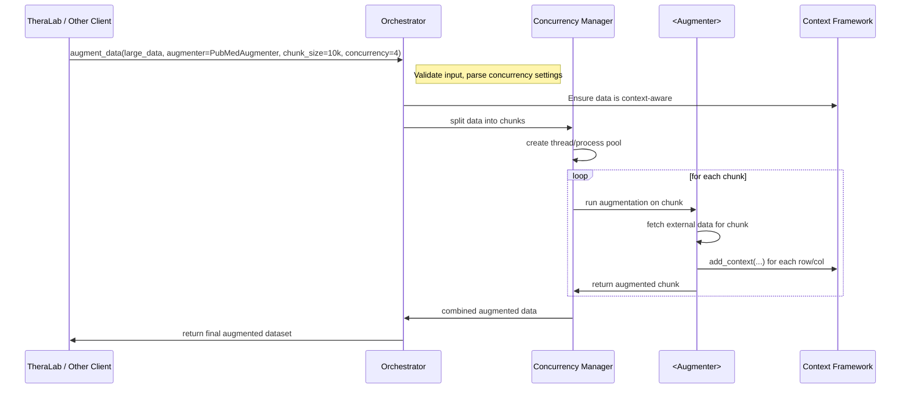
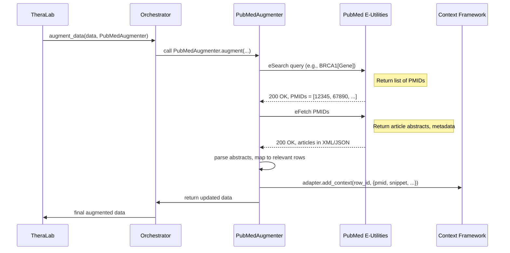
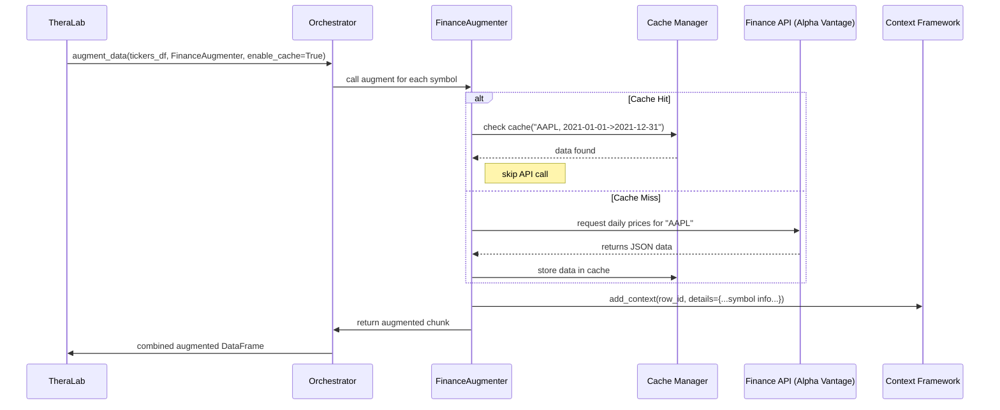
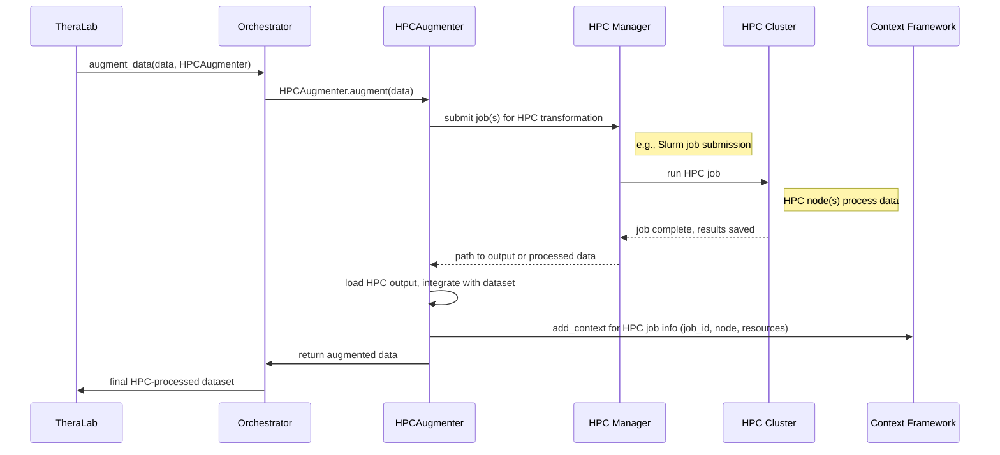
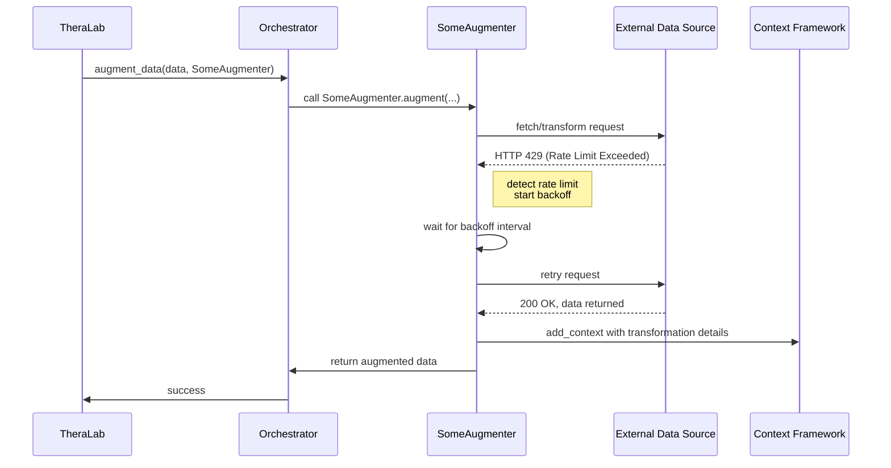

Below is an example of a **Sequence Diagrams** documentation file for the **data-augmentation-framework**. It illustrates how various components—such as augmenters, concurrency layers, and the context-tracking framework—interact during data augmentation workflows. You can adapt and expand these diagrams to match your specific use cases, naming conventions, and technologies.

---

# Data Augmentation Framework  
**Sequence Diagrams**  
`docs/design/sequence_diagrams.md`

## 1. Introduction

This document presents **sequence diagrams** that show how requests flow through the **Data Augmentation Framework**. The diagrams highlight the interactions between:

- **Clients** (e.g., TheraLab or other caller)  
- **The Orchestrator** (the high-level entry point in the augmentation framework)  
- **Augmenters** (e.g., PubMedAugmenter, FinanceAugmenter)  
- **Concurrency Manager** (handles chunking, parallelism, or HPC job scheduling)  
- **Context-Tracking Framework** (logs and retrieves context/provenance)

By visualizing these interactions, developers and stakeholders can better understand the **lifecycle** of an augmentation task, from the initial request to the final returned data and context logging.

---

## 2. Basic Augmentation Request

The following diagram shows a **simple** (non-chunked, single-threaded) augmentation request initiated by the caller, passing through the framework, and updating the context store.

### Explanation
1. **Caller** invokes `augment_data(...)` on the Orchestrator, specifying which augmenter to use.  
2. **Orchestrator** checks if the incoming data is already context-aware. If not, it wraps the data with an appropriate **Context Adapter** from the `context-framework`.  
3. The **Augmenter** fetches or computes any external data needed (e.g., PubMed results).  
4. The **Augmenter** logs its operations via the **Context Framework** (e.g., storing provenance).  
5. Finally, the **Orchestrator** returns the augmented (and context-enriched) data to the caller.

---

## 3. Chunked Concurrency Flow

For **large datasets**, the Data Augmentation Framework may employ **chunked** or **parallel** execution. The sequence diagram below illustrates how an orchestrator might break the data into chunks, assign them to augmenters, and then merge the results.

### Key Points
- **Concurrency Manager**: Responsible for splitting the input data into fixed-size chunks (e.g., 10k rows each).  
- **Parallel Execution**: Each chunk runs in a separate thread or process, enabling faster augmentation.  
- **Context Logging**: Occurs at the row/column level for each chunk.  
- **Merging Results**: The concurrency manager merges the chunks back into one combined context-aware data structure.

---

## 4. PubMedAugmenter Detailed Sequence

The next diagram dives deeper into a **PubMedAugmenter** scenario, where the augmenter queries PubMed’s E-utilities and logs results. It shows the external API interaction explicitly.

### Explanation
1. **Augmenter** performs two main steps: **eSearch** to get PMIDs, then **eFetch** to get full abstracts.  
2. After receiving the raw data, the augmenter **parses** the articles and updates the relevant rows.  
3. **Context** is logged for each row or gene ID with the PMIDs and partial article info.  
4. The Orchestrator returns the enriched DataFrame (or context-aware structure) back to the caller.

---

## 5. FinanceAugmenter with Caching

This diagram focuses on a **FinanceAugmenter** retrieving stock prices from a finance API and using a **local cache** to avoid repeated requests.

### Notable Steps
- **Check Cache**: The augmenter first checks the local or distributed cache for existing data.  
- **API Call**: Only if the cache misses, the augmenter calls the finance API.  
- **Context Logging**: Each row or symbol is updated with the retrieved financial data’s provenance.  
- **Return**: The orchestrator merges augmented chunks and returns final data.

---

## 6. HPC-Based Transformation Example

For HPC or GPU-based transformations, the sequence might involve job submission and waiting for completion:

### Commentary
- **HPCAugmenter** delegates intensive tasks to an HPC cluster, possibly for GPU-accelerated transformations.  
- **HPCMgr** handles job submission, monitoring, and retrieving results.  
- **Context Logging** includes HPC job IDs, resource usage, etc.

---

## 7. Error Handling & Retry Sequence

Below is a simplified sequence for how the Data Augmentation Framework handles transient errors or rate limits when calling an external API.

### Notes
- The **Augmenter** includes logic for **retry with exponential backoff** or a similar strategy.  
- Each attempt or failure is **logged** (including the final success or failure) in the context store or general logs.

---

## 8. Summary & Conclusion

These **sequence diagrams** illustrate how requests progress through the **Data Augmentation Framework**, covering:

1. **Simple augmentations**  
2. **Chunked concurrency**  
3. **PubMed** and **Finance** integrations  
4. **HPC** job-based transformations  
5. **Error and retry flows**  

By standardizing these flows, developers can maintain **consistent patterns** for context logging, error handling, concurrency, and caching across all augmenters. When adding **new data sources** or **advanced HPC** logic, use the diagrams above as a reference to ensure **clear, traceable** interactions and robust system behavior.

---

**Document History**  
- **v1.0** – Initial set of sequence diagrams for major use cases.  
- **v1.1** – Added HPC transformation example and error handling sequence.

_End of Document_